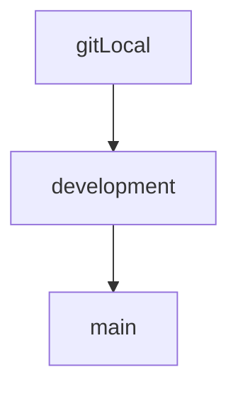

# IE402.O11-BT1

## The Graph demonstrate Git branchs

## First time
1. Clone repository
```
git clone https://github.com/varia418/IE402.O11-BT1.git
```
2. Create and switch to `development` branch
```
git checkout -b development
```
3. Pull code from `development` branch
```
git pull origin development
```
4. Create your branch at git local
```
git checkout -b <branch-name>
```
Branch name format: `<mssv>_<ward or street>`
## In later times, to submit code

1. Commit your code at local
```
git add .
git commit -m "<commit-message>"
```
2. Push your code to remote
```
git push origin <branch-name>
```
